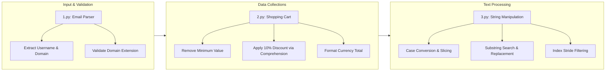

# CET MCA Semester 1 Python Programming

Practical lab exercises and problem-solving implementations for the first-semester Master of Computer Applications (MCA) curriculum at the College of Engineering Trivandrum (CET).

<p align="center">
  
  
  
</p>

---



---

## Overview

This repository contains Python programming laboratory implementations developed for the first-semester MCA coursework at the College of Engineering Trivandrum (CET). Each program demonstrates fundamental concepts in Python 3, spanning user input handling, string parsing, list transformations, and built-in method utilization.

---

## Program Index

| Script         | Topic                             | Key Concepts                                                                                                     | Status   |
| -------------- | --------------------------------- | ---------------------------------------------------------------------------------------------------------------- | -------- |
| [1.py](./1.py) | Email Address Parser & Validator  | String splitting (`split`), title formatting (`title`), suffix checking (`endswith`)                             | Complete |
| [2.py](./2.py) | Shopping Cart Discount Calculator | List manipulation (`min`, `remove`), list comprehension, aggregation (`sum`), decimal formatting                 | Complete |
| [3.py](./3.py) | String Methods & Slicing Suite    | Case transformation, substring slicing, midpoint division, string strip, character replacement, stride filtering | Complete |

---

## Core Capabilities

- **Input Parsing & Validation:** Extract components such as usernames, domains, and top-level extensions from formatted user strings with boundary validation.
- **Collection Transformation:** Manipulate numeric lists by identifying minimum entries, generating discounted price collections with list comprehensions, and computing rounded totals.
- **String Manipulation:** Apply standard library string methods and slicing syntax to reverse, subdivide, search, count, and filter character sequences.

---

## Quick Start

### 1. Clone the Repository

```bash
git clone https://github.com/ashfakhm/CET_MCA_1st_Sem_Python_Programming.git
cd CET_MCA_1st_Sem_Python_Programming
```

### 2. Verify Python Installation

Ensure Python 3.8 or higher is installed:

```bash
python3 --version
```

No external third-party dependencies are required. All programs run on the standard Python runtime.

---

## Program Usage & Outputs

### Program 1: Email Address Parser (`1.py`)

Takes an email address as input, separates the username and domain, and verifies whether the domain ends with `.com`.

```bash
python3 1.py
```

**Example Run:**

```text
Enter Your Email Address alex.morgan@gmail.com
Username : Alex.Morgan
Domain : gmail
Extension : com
Ends With .com? :True
```

---

### Program 2: Shopping Cart Price Calculator (`2.py`)

Removes the lowest-priced item from a price list, applies a 10% discount to all remaining items using list comprehensions, and outputs the final formatted total.

```bash
python3 2.py
```

**Example Run:**

```text
Final total: $159.75
```

---

### Program 3: String Methods Practice (`3.py`)

Executes a comprehensive sequence of string operations including case conversions, length calculation, substring extraction, string division, character replacement, and index searching.

```bash
python3 3.py
```

**Example Run:**

```text
Enter a string: Data Science
Capital: DATA SCIENCE
Lowercase: data science
Camel case: dataScience
Enter another string: Analytics
Concatenated string: Data Science Analytics
Number of characters: 12
4th character: a
Substring: ata
First part: Data S
Second part: cience
Without leading/trailing whitespace: Data Science
After replacing "a" with "f": Dftf Science
After removing even-indexed characters: aaSine
Number of occurrences of "a": 2
Index of "o": -1 (not found)
```

---

## Repository Structure

```text
CET_MCA_1st_Sem_Python_Programming/
├── 1.py              # Email parser and domain/extension validator
├── 2.py              # Shopping cart price and discount calculator
├── 3.py              # String manipulation and built-in methods practice
└── README.md         # Repository documentation and program guide
```
