```mermaid
flowchart LR
    subgraph Lab01["Input & Validation"]
        direction TB
        A["1.py: Email Parser"]
        A --> A1["Extract Username & Domain"]
        A --> A2["Validate Domain Extension"]
    end

    subgraph Lab02["Data Collections"]
        direction TB
        B["2.py: Shopping Cart"]
        B --> B1["Remove Minimum Value"]
        B --> B2["Apply 10% Discount via Comprehension"]
        B --> B3["Format Currency Total"]
    end

    subgraph Lab03["Text Processing"]
        direction TB
        C["3.py: String Manipulation"]
        C --> C1["Case Conversion & Slicing"]
        C --> C2["Substring Search & Replacement"]
        C --> C3["Index Stride Filtering"]
    end

    subgraph Lab04["List Operations"]
        direction TB
        D["4.py: List Practice"]
        D --> D1["Sort, Reverse & Insert"]
        D --> D2["Append, Remove & Pop"]
        D --> D3["Digit Extract & Binary Convert"]
    end

    subgraph Lab05["Dictionary Operations"]
        direction TB
        E["5.py: Dictionary Practice"]
        E --> E1["Create, Insert & Lookup"]
        E --> E2["Merge & Update"]
        E --> E3["Swap & Sort Keys"]
    end

    Lab01 --> Lab02 --> Lab03 --> Lab04 --> Lab05
```

# CET MCA Semester 1 Python Programming

Practical lab exercises and problem-solving implementations for the first-semester Master of Computer Applications (MCA) curriculum at the College of Engineering Trivandrum (CET).

<p align="center">
  
  
  
</p>

---



---

## Overview

This repository contains Python programming laboratory implementations developed for the first-semester MCA coursework at the College of Engineering Trivandrum (CET). Each program demonstrates fundamental concepts in Python 3, spanning user input handling, string parsing, list transformations, dictionary operations, and built-in method utilization.

---

## Program Index

| Script         | Topic                             | Key Concepts                                                                                                     | Status   |
| -------------- | --------------------------------- | ---------------------------------------------------------------------------------------------------------------- | -------- |
| [1.py](./1.py) | Email Address Parser & Validator  | String splitting (`split`), title formatting (`title`), suffix checking (`endswith`)                             | Complete |
| [2.py](./2.py) | Shopping Cart Discount Calculator | List manipulation (`min`, `remove`), list comprehension, aggregation (`sum`), decimal formatting                 | Complete |
| [3.py](./3.py) | String Methods & Slicing Suite    | Case transformation, substring slicing, midpoint division, string strip, character replacement, stride filtering | Complete |
| [4.py](./4.py) | List Operations Practice          | Sorting (`sort`), reversing (`reverse`), insertion (`insert`/`append`), removal (`remove`/`pop`/`clear`), digit extraction, binary conversion (`bin`), square roots (`math.sqrt`), manual number reversal | Complete |
| [5.py](./5.py) | Dictionary Operations Practice    | Dict creation, insertion, lookup, deletion (`pop`/`clear`), values/keys extraction, update, merge (`\|`), variable swapping, sorting (`sorted`) | Complete |

---

## Core Capabilities

- **Input Parsing & Validation:** Extract components such as usernames, domains, and top-level extensions from formatted user strings with boundary validation.
- **Collection Transformation:** Manipulate numeric lists by identifying minimum entries, generating discounted price collections with list comprehensions, and computing rounded totals.
- **String Manipulation:** Apply standard library string methods and slicing syntax to reverse, subdivide, search, count, and filter character sequences.
- **List Operations:** Demonstrate 14 essential list workflows — sorting, reversing, indexed insertion/removal, digit extraction, binary conversion, and manual number reversal with input validation.
- **Dictionary Operations:** Demonstrate 13 dictionary workflows — key-value creation, lookup, deletion, merging via `|`, view extraction (`keys`/`values`), in-place update, and key-sorted ordering.

---

## Quick Start

### 1. Clone the Repository

```bash
git clone https://github.com/ashfakhm/CET_MCA_1st_Sem_Python_Programming.git
cd CET_MCA_1st_Sem_Python_Programming
```

### 2. Verify Python Installation

Ensure Python 3.8 or higher is installed:

```bash
python3 --version
```

No external third-party dependencies are required. All programs run on the standard Python runtime.

---

## Program Usage & Outputs

### Program 1: Email Address Parser (`1.py`)

Takes an email address as input, separates the username and domain, and verifies whether the domain ends with `.com`.

```bash
python3 1.py
```

**Example Run:**

```text
Enter Your Email Address alex.morgan@gmail.com
Username : Alex.Morgan
Domain : gmail
Extension : com
Ends With .com? :True
```

---

### Program 2: Shopping Cart Price Calculator (`2.py`)

Removes the lowest-priced item from a price list, applies a 10% discount to all remaining items using list comprehensions, and outputs the final formatted total.

```bash
python3 2.py
```

**Example Run:**

```text
Final total: $159.75
```

---

### Program 3: String Methods Practice (`3.py`)

Executes a comprehensive sequence of string operations including case conversions, length calculation, substring extraction, string division, character replacement, and index searching.

```bash
python3 3.py
```

**Example Run:**

```text
Enter a string: Data Science
Capital: DATA SCIENCE
Lowercase: data science
Camel case: dataScience
Enter another string: Analytics
Concatenated string: Data Science Analytics
Number of characters: 12
4th character: a
Substring: ata
First part: Data S
Second part: cience
Without leading/trailing whitespace: Data Science
After replacing "a" with "f": Dftf Science
After removing even-indexed characters: aaSine
Number of occurrences of "a": 2
Index of "o": -1 (not found)
```

---

### Program 4: List Operations Practice (`4.py`)

Demonstrates 14 common list operations — sorting, reversing, element insertion/removal by value and position, clearing, length counting, digit extraction, binary conversion, square-root mapping, copying, and manual number reversal without built-ins.

```bash
python3 4.py
```

**Example Run (abridged):**

```text
Enter numbers separated by spaces: 10 30 20
Original list: [10, 30, 20]
Sorted list: [10, 20, 30]
Reversed list: [30, 20, 10]
Enter an element to add: 50
List after adding 50: [30, 20, 10, 50]
Enter an element to remove: 20
List after removing 20: [30, 10, 50]
Enter the position to remove: 1
Removed element: 10
List after removing position 1: [30, 50]
List after removing all elements: []
Number of elements: 5
Enter a number: 12345
Digits: [1, 2, 3, 4, 5]
Enter a number: 10
Binary representation: 0b1010
Numbers: [4, 9, 16, 25, 36]
Square roots: [2.0, 3.0, 4.0, 5.0, 6.0]
Original list: [10, 20, 30, 40]
Copied list: [10, 20, 30, 40]
Enter a number: 12345
Original number: 12345
Reversed number: 54321
Enter an element to insert: 99
Enter the position: 1
List after inserting 99 at position 1: [10, 99, 20, 30, 40]
```

---

### Program 5: Dictionary Operations Practice (`5.py`)

Demonstrates 13 dictionary operations — creation from user input, key-value insertion, lookup, value deletion vs key removal, clearing, `values()`/`keys()` extraction, in-place update, merging with `|`, variable swapping, and key-sorted ordering.

```bash
python3 5.py
```

**Example Run (abridged):**

```text
Enter your name: Ash
Enter your age: 20
Dictionary: {'name': 'Ash', 'age': 20}
Enter a key: course
Enter a value: MCA
Dictionary after insertion: {'name': 'Ash', 'age': 20, 'course': 'MCA'}
Enter a key to search: name
Value: Ash
Enter the key whose value you want to delete: course
Dictionary after deleting the value: {'name': 'Ash', 'age': 20, 'course': None}
Enter the key to remove: course
Removed value: None
Dictionary after removing the key: {'name': 'Ash', 'age': 20}
Dictionary after removing all values: {}
All values: ['Ash', 20, 'Computer Science']
Dictionary after updating age: {'name': 'Ash', 'age': 21, 'course': 'Computer Science'}
All keys: ['name', 'age', 'course']
Merged dictionary: {'name': 'Ash', 'age': 20, 'course': 'Computer Science', 'college': 'ABC College'}
First number: 20
Second number: 10
First number: 20
Second number: 10
Original dictionary: {'John': 75, 'Alex': 90, 'David': 60, 'Sam': 85}
Sorted dictionary: {'Alex': 90, 'David': 60, 'John': 75, 'Sam': 85}
```

---

## Repository Structure

```text
CET_MCA_1st_Sem_Python_Programming/
├── 1.py              # Email parser and domain/extension validator
├── 2.py              # Shopping cart price and discount calculator
├── 3.py              # String manipulation and built-in methods practice
├── 4.py              # List operations — sort, reverse, insert, remove, pop, clear, digit extract, binary
├── 5.py              # Dictionary operations — create, lookup, delete, merge, update, swap, sort
└── README.md         # Repository documentation and program guide
```
