```mermaid
flowchart LR
    subgraph Lab01["Input & Validation"]
        direction TB
        A["1.py: Email Parser"]
        A --> A1["Extract Username & Domain"]
        A --> A2["Validate Domain Extension"]
    end

    subgraph Lab02["Data Collections"]
        direction TB
        B["2.py: Shopping Cart"]
        B --> B1["Remove Minimum Value"]
        B --> B2["Apply 10% Discount via Comprehension"]
        B --> B3["Format Currency Total"]
    end

    subgraph Lab03["Text Processing"]
        direction TB
        C["3.py: String Manipulation"]
        C --> C1["Case Conversion & Slicing"]
        C --> C2["Substring Search & Replacement"]
        C --> C3["Index Stride Filtering"]
    end

    subgraph Lab04["List Operations"]
        direction TB
        D["4.py: List Practice"]
        D --> D1["Sort, Reverse & Insert"]
        D --> D2["Append, Remove & Pop"]
        D --> D3["Digit Extract & Binary Convert"]
    end

    subgraph Lab05["Dictionary & Matrix Operations"]
        direction TB
        E["5.py: Dictionary & Matrix Practice"]
        E --> E1["Create, Insert & Lookup"]
        E --> E2["Merge & Update"]
        E --> E3["Swap & Sort Keys"]
        E --> E4["1D & 2D Matrices (Pure Python)"]
        E --> E5["3D Transpose (No NumPy)"]
    end

    subgraph Lab06["Score Processing"]
        direction TB
        F["6.py: Tournament Points"]
        F --> F1["Parse Scores & Compare"]
        F --> F2["Count W/D/L & Calculate Points"]
        F --> F3["Build Summary Dictionary"]
    end

    subgraph Lab07["Pattern Generation"]
        direction TB
        G["7.py: Star Pattern"]
        G --> G1["Increasing Stars Loop"]
        G --> G2["Decreasing Stars Loop"]
    end

    subgraph Lab08["Math Functions"]
        direction TB
        H["8.py: GCD Calculator"]
        H --> H1["Euclidean Algorithm"]
        H --> H2["Modulo Iteration"]
    end

    subgraph Lab09["Frequency Analysis"]
        direction TB
        I["9.py: Character Frequency"]
        I --> I1["Dictionary Counting"]
        I --> I2["Iterate & Tally"]
    end

    subgraph Lab10["Series Generation"]
        direction TB
        J["10.py: Fibonacci Series"]
        J --> J1["Iterative Generation"]
        J --> J2["Tuple Unpacking Swap"]
    end

    subgraph Lab11["String Expression"]
        direction TB
        K["11.py: n+nn+nnn"]
        K --> K1["String Repetition"]
        K --> K2["Type Conversion & Sum"]
    end

    subgraph Lab12["Text Analysis"]
        direction TB
        L["12.py: Longest Word"]
        L --> L1["Split & Iterate"]
        L --> L2["Max by Key Length"]
    end

    subgraph Lab13["Functional Programming"]
        direction TB
        M["13.py: Area Calculator"]
        M --> M1["Lambda: Square"]
        M --> M2["Lambda: Rectangle"]
        M --> M3["Lambda: Triangle"]
    end

    Lab01 --> Lab02 --> Lab03 --> Lab04 --> Lab05 --> Lab06 --> Lab07 --> Lab08 --> Lab09 --> Lab10 --> Lab11 --> Lab12 --> Lab13
```

# CET MCA Semester 1 Python Programming

Practical lab exercises and problem-solving implementations for the first-semester Master of Computer Applications (MCA) curriculum at the College of Engineering Trivandrum (CET).

<p align="center">
  
  
  
</p>

---



---

## Overview

This repository contains Python programming laboratory implementations developed for the first-semester MCA coursework at the College of Engineering Trivandrum (CET). Each program demonstrates fundamental concepts in Python 3.14, spanning user input handling, string parsing, list transformations, dictionary operations, pure-Python matrix workflows (1D/2D addition and 3D transpose without NumPy), score parsing, tournament points aggregation, pattern generation, GCD computation via Euclidean algorithm, character frequency analysis, Fibonacci series generation, string-based numeric expressions, longest word detection, and lambda-based functional area calculations.

---

## Program Index

| Script         | Topic                             | Key Concepts                                                                                                     | Status   |
| -------------- | --------------------------------- | ---------------------------------------------------------------------------------------------------------------- | -------- |
| [1.py](./1.py) | Email Address Parser & Validator  | String splitting (`split`), title formatting (`title`), suffix checking (`endswith`)                             | Complete |
| [2.py](./2.py) | Shopping Cart Discount Calculator | List manipulation (`min`, `remove`), list comprehension, aggregation (`sum`), decimal formatting                 | Complete |
| [3.py](./3.py) | String Methods & Slicing Suite    | Case transformation, substring slicing, midpoint division, string strip, character replacement, stride filtering | Complete |
| [4.py](./4.py) | List Operations Practice          | Sorting (`sort`), reversing (`reverse`), insertion (`insert`/`append`), removal (`remove`/`pop`/`clear`), digit extraction, binary conversion (`bin`), square roots (`math.sqrt`), manual number reversal | Complete |
| [5.py](./5.py) | Dictionary & Matrix Operations Practice | Dict creation, insertion, lookup, deletion (`pop`/`clear`), values/keys extraction, update, merge (`\|`), variable swapping, sorting (`sorted`), 1D list matrix, 2D addition via list comprehensions, 3D transpose by axis reversal (no NumPy) | Complete |
| [6.py](./6.py) | Sports Tournament Points Table Generator | Score parsing (`split`/`map`), conditional counting, points accumulation (3/1/0), dictionary summary | Complete |
| [7.py](./7.py) | Star Pattern Generator | Nested loops, string repetition (`*`), increasing/decreasing pattern, function abstraction | Complete |
| [8.py](./8.py) | GCD Calculator | Euclidean algorithm, modulo operation (`%`), tuple unpacking, `while` loop | Complete |
| [9.py](./9.py) | Character Frequency Counter | Dictionary tally, string iteration, membership testing (`in`), key-value accumulation | Complete |
| [10.py](./10.py) | Fibonacci Series Generator | Iterative sequence generation, tuple unpacking swap, list accumulation (`append`) | Complete |
| [11.py](./11.py) | n + nn + nnn Expression Evaluator | String repetition, type conversion (`str`/`int`), arithmetic composition | Complete |
| [12.py](./12.py) | Longest Word Length Finder | String splitting (`split`), `max` with `key=len`, length calculation (`len`) | Complete |
| [13.py](./13.py) | Lambda Area Calculator | Lambda functions, square/rectangle/triangle area formulas, formatted output (`:.2f`) | Complete |

---

## Core Capabilities

- **Input Parsing & Validation:** Extract components such as usernames, domains, and top-level extensions from formatted user strings with boundary validation.
- **Collection Transformation:** Manipulate numeric lists by identifying minimum entries, generating discounted price collections with list comprehensions, and computing rounded totals.
- **String Manipulation:** Apply standard library string methods and slicing syntax to reverse, subdivide, search, count, and filter character sequences.
- **List Operations:** Demonstrate 14 essential list workflows — sorting, reversing, indexed insertion/removal, digit extraction, binary conversion, and manual number reversal with input validation.
- **Dictionary & Matrix Operations:** Demonstrate 16 workflows — key-value creation, lookup, deletion, merging via `|`, view extraction (`keys`/`values`), in-place update, key-sorted ordering, plus pure-Python 1D/2D/3D matrix creation, 2D addition, and 3D transpose without NumPy.
- **Score Processing & Aggregation:** Parse hyphen-delimited score strings, classify wins/draws/losses, accumulate league points (3 for win / 1 for draw), and emit a summary dictionary.
- **Pattern Generation:** Build increasing/decreasing star patterns using nested loops and string repetition with function abstraction.
- **Mathematical Computation:** Calculate GCD via iterative Euclidean algorithm with modulo and tuple unpacking.
- **Frequency Analysis:** Count character occurrences using dictionary tallying and membership testing.
- **Series Generation:** Generate Fibonacci sequences iteratively with tuple swap and list accumulation.
- **Expression Evaluation:** Compute `n + nn + nnn` via string repetition and type conversion.
- **Text Analysis:** Find longest word length using `max` with `key=len` after splitting input strings.
- **Functional Programming:** Calculate geometric areas (square, rectangle, triangle) using concise lambda functions and formatted output.

---

## Quick Start

### 1. Clone the Repository

```bash
git clone https://github.com/ashfakhm/CET_MCA_1st_Sem_Python_Programming.git
cd CET_MCA_1st_Sem_Python_Programming
```

### 2. Verify Python Installation

Ensure Python 3.14 or higher is installed (see `.python-version`):

```bash
python3 --version
```

All lab programs run on the standard Python runtime with no required third-party dependencies. Pure-Python matrix operations in `5.py` avoid NumPy. If `uv` is available, an optional environment can be set up via:

```bash
uv sync
```

---

## Program Usage & Outputs

### Program 1: Email Address Parser (`1.py`)

Takes an email address as input, separates the username and domain, and verifies whether the domain ends with `.com`.

```bash
python3 1.py
```

**Example Run:**

```text
Enter Your Email Address alex.morgan@gmail.com
Username : Alex.Morgan
Domain : gmail
Extension : com
Ends With .com? :True
```

---

### Program 2: Shopping Cart Price Calculator (`2.py`)

Removes the lowest-priced item from a price list, applies a 10% discount to all remaining items using list comprehensions, and outputs the final formatted total.

```bash
python3 2.py
```

**Example Run:**

```text
Final total: $159.75
```

---

### Program 3: String Methods Practice (`3.py`)

Executes a comprehensive sequence of string operations including case conversions, length calculation, substring extraction, string division, character replacement, and index searching.

```bash
python3 3.py
```

**Example Run:**

```text
Enter a string: Data Science
Capital: DATA SCIENCE
Lowercase: data science
Camel case: dataScience
Enter another string: Analytics
Concatenated string: Data Science Analytics
Number of characters: 12
4th character: a
Substring: ata
First part: Data S
Second part: cience
Without leading/trailing whitespace: Data Science
After replacing "a" with "f": Dftf Science
After removing even-indexed characters: aaSine
Number of occurrences of "a": 2
Index of "o": -1 (not found)
```

---

### Program 4: List Operations Practice (`4.py`)

Demonstrates 14 common list operations — sorting, reversing, element insertion/removal by value and position, clearing, length counting, digit extraction, binary conversion, square-root mapping, copying, and manual number reversal without built-ins.

```bash
python3 4.py
```

**Example Run (abridged):**

```text
Enter numbers separated by spaces: 10 30 20
Original list: [10, 30, 20]
Sorted list: [10, 20, 30]
Reversed list: [30, 20, 10]
Enter an element to add: 50
List after adding 50: [30, 20, 10, 50]
Enter an element to remove: 20
List after removing 20: [30, 10, 50]
Enter the position to remove: 1
Removed element: 10
List after removing position 1: [30, 50]
List after removing all elements: []
Number of elements: 5
Enter a number: 12345
Digits: [1, 2, 3, 4, 5]
Enter a number: 10
Binary representation: 0b1010
Numbers: [4, 9, 16, 25, 36]
Square roots: [2.0, 3.0, 4.0, 5.0, 6.0]
Original list: [10, 20, 30, 40]
Copied list: [10, 20, 30, 40]
Enter a number: 12345
Original number: 12345
Reversed number: 54321
Enter an element to insert: 99
Enter the position: 1
List after inserting 99 at position 1: [10, 99, 20, 30, 40]
```

---

### Program 5: Dictionary & Matrix Operations Practice (`5.py`)

Demonstrates 16 operations — dictionary creation from user input, key-value insertion, lookup, value deletion vs key removal, clearing, `values()`/`keys()` extraction, in-place update, merging with `|`, variable swapping, key-sorted ordering, plus pure-Python 1D matrix, 2D matrix addition, and 3D transpose without NumPy.

```bash
python3 5.py
```

**Example Run (abridged):**

```text
Enter your name: Ash
Enter your age: 20
Dictionary: {'name': 'Ash', 'age': 20}
Enter a key: course
Enter a value: MCA
Dictionary after insertion: {'name': 'Ash', 'age': 20, 'course': 'MCA'}
Enter a key to search: name
Value: Ash
Enter the key whose value you want to delete: course
Dictionary after deleting the value: {'name': 'Ash', 'age': 20, 'course': None}
Enter the key to remove: course
Removed value: None
Dictionary after removing the key: {'name': 'Ash', 'age': 20}
Dictionary after removing all values: {}
All values: ['Ash', 20, 'Computer Science']
Dictionary after updating age: {'name': 'Ash', 'age': 21, 'course': 'Computer Science'}
All keys: ['name', 'age', 'course']
Merged dictionary: {'name': 'Ash', 'age': 20, 'course': 'Computer Science', 'college': 'ABC College'}
First number: 20
Second number: 10
First number: 20
Second number: 10
Original dictionary: {'John': 75, 'Alex': 90, 'David': 60, 'Sam': 85}
Sorted dictionary: {'Alex': 90, 'David': 60, 'John': 75, 'Sam': 85}
1D matrix: [10, 20, 30, 40, 50]
First matrix: [[1, 2], [3, 4]]
Second matrix: [[5, 6], [7, 8]]
Result after addition: [[6, 8], [10, 12]]
[6, 8]
[10, 12]
Original 3D matrix: [[[1, 2], [3, 4]], [[5, 6], [7, 8]]]
Transposed 3D matrix: [[[1, 5], [3, 7]], [[2, 6], [4, 8]]]
```

---

### Program 6: Sports Tournament Points Table Generator (`6.py`)

Processes a list of hyphen-delimited match scores, compares team vs opponent scores, counts wins/draws/losses, calculates total league points (3 per win, 1 per draw), and stores results in a summary dictionary.

```bash
python3 6.py
```

**Example Run:**

```text
Match results: ['3-1', '0-0', '1-2', '2-2', '4-0']
Summary: {'Wins': 2, 'Draws': 2, 'Losses': 1, 'Total Points': 8}
```

---

### Program 7: Star Pattern Generator (`7.py`)

Prints an increasing then decreasing star pattern based on user input, using a function with loop-driven string repetition.

```bash
python3 7.py
```

**Example Run:**

```text
Enter a number: 3
*
**
***
**
*
```

---

### Program 8: GCD Calculator (`8.py`)

Computes the greatest common divisor of two integers using the iterative Euclidean algorithm with modulo and tuple unpacking.

```bash
python3 8.py
```

**Example Run:**

```text
Enter the first number: 48
Enter the second number: 18
GCD of 48 and 18: 6
```

---

### Program 9: Character Frequency Counter (`9.py`)

Counts the frequency of each character in a user-provided string using dictionary tallying.

```bash
python3 9.py
```

**Example Run:**

```text
Enter a string: hello
Character frequency: {'h': 1, 'e': 1, 'l': 2, 'o': 1}
```

---

### Program 10: Fibonacci Series Generator (`10.py`)

Generates a Fibonacci series with the specified number of terms using iterative tuple unpacking.

```bash
python3 10.py
```

**Example Run:**

```text
Enter the number of terms: 7
Fibonacci series: [0, 1, 1, 2, 3, 5, 8]
```

---

### Program 11: n + nn + nnn Expression Evaluator (`11.py`)

Accepts an integer `n` and computes `n + nn + nnn` via string repetition and type conversion.

```bash
python3 11.py
```

**Example Run:**

```text
Enter a number: 5
Result of n + nn + nnn: 615
```

---

### Program 12: Longest Word Length Finder (`12.py`)

Accepts a list of words and returns the length of the longest word using `max` with `key=len`.

```bash
python3 12.py
```

**Example Run:**

```text
Enter words separated by spaces: hi hello world
Length of the longest word: 5
```

---

### Program 13: Lambda Area Calculator (`13.py`)

Calculates areas of a square, rectangle, and triangle using lambda functions and formatted output.

```bash
python3 13.py
```

**Example Run:**

```text
Enter the side of the square: 4
Enter the length of the rectangle: 5
Enter the width of the rectangle: 3
Enter the base of the triangle: 6
Enter the height of the triangle: 4
Area of square: 16.00
Area of rectangle: 15.00
Area of triangle: 12.00
```

---

## Repository Structure

```text
CET_MCA_1st_Sem_Python_Programming/
├── 1.py              # Email parser and domain/extension validator
├── 2.py              # Shopping cart price and discount calculator
├── 3.py              # String manipulation and built-in methods practice
├── 4.py              # List operations — sort, reverse, insert, remove, pop, clear, digit extract, binary
├── 5.py              # Dictionary & matrix — create, lookup, delete, merge, update, swap, sort, 1D/2D/3D pure-Python matrices
├── 6.py              # Tournament points — parse scores, count W/D/L, calculate points, build summary dict
├── 7.py              # Star pattern — increasing/decreasing stars via loops and string repetition
├── 8.py              # GCD calculator — Euclidean algorithm with modulo and tuple unpacking
├── 9.py              # Character frequency — dictionary tally of string characters
├── 10.py             # Fibonacci series — iterative generation with tuple swap
├── 11.py             # n+nn+nnn expression — string repetition and type conversion
├── 12.py             # Longest word — split input and max by key length
├── 13.py             # Area calculator — lambda functions for square/rectangle/triangle
├── pyproject.toml    # uv project metadata (requires-python >=3.14)
├── uv.lock           # Locked dependency graph
├── .python-version   # Python 3.14 pin
└── README.md         # Repository documentation and program guide
```
